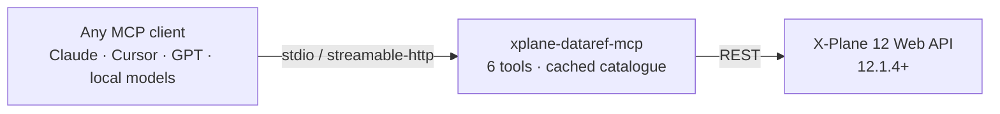
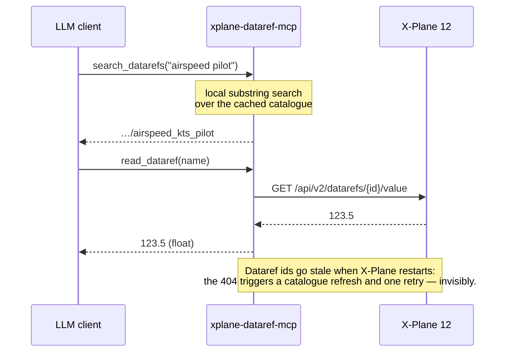

# xplane-dataref-mcp

[](https://github.com/Santisoutoo/xplane-dataref-mcp/actions/workflows/ci.yml)
[](https://pypi.org/project/xplane-dataref-mcp/)

An [MCP](https://modelcontextprotocol.io) server that gives any LLM client raw access to a
running X-Plane 12: search its ~10,000 datarefs and ~3,000 commands by substring, read values,
and fire commands — over X-Plane's own Web API. It exists mostly for the lookup problem: nobody
knows the string `sim/cockpit2/gauges/indicators/airspeed_kts_pilot` before finding it, and the
Web API itself only filters by exact name. For instructor-level operations ("place me on a
10 NM final") see its high-level sibling, [xplane-mcp](https://github.com/Santisoutoo/xplane-mcp).



## Tools

| Tool | |
|---|---|
| `get_connection_status` | Is X-Plane reachable, and what does its API offer? Reported as data, not as an error. |
| `search_datarefs` | Substring search (AND of terms, case-insensitive) over every dataref name. |
| `read_dataref` | One dataref's current value, by exact name; `index` picks an array element. |
| `read_datarefs` | Several at once, read concurrently — one snapshot of related state. |
| `search_commands` | The same search over command names and descriptions. |
| `execute_command` | Press a command, or hold it for up to 10 s. |

Byte-array (`data`) datarefs are decoded from base64 to text when they are text. Writing
datarefs is deliberately absent — commands cover acting on the simulator with X-Plane's own
semantics and bounds.

## How it works



## Quick start

1. X-Plane **12.1.4+**, Settings → Network → *Accept incoming connections* (serves on port 8086).
2. `claude mcp add xplane-datarefs -- uvx xplane-dataref-mcp` — or open your client below.
3. Ask: *"what's my airspeed?"*

The server starts fine with the simulator down — the moment X-Plane comes up, the tools work,
no restart needed.

<details>
<summary>Persistent install / from source</summary>

```bash
uv tool install xplane-dataref-mcp      # or: pip install xplane-dataref-mcp
uvx --from git+https://github.com/Santisoutoo/xplane-dataref-mcp xplane-dataref-mcp   # from source
```

</details>

## Use with your client

Every stdio config is the same idea — `command: uvx`, `args: ["xplane-dataref-mcp"]` — dressed
in each client's file format. If X-Plane is not at the default `http://127.0.0.1:8086`, add
`XPLANE_URL` via the config's `env` field (shown once, in the Claude Code example).

<details open>
<summary><b>Claude Code</b></summary>

```bash
claude mcp add xplane-datarefs -- uvx xplane-dataref-mcp
```

Or as a project-scoped `.mcp.json`:

```json
{
  "mcpServers": {
    "xplane-datarefs": {
      "command": "uvx",
      "args": ["xplane-dataref-mcp"],
      "env": { "XPLANE_URL": "http://127.0.0.1:8086" }
    }
  }
}
```

</details>

<details>
<summary><b>Claude Desktop</b></summary>

Settings → Developer → Edit Config, then in `claude_desktop_config.json`:

```json
{
  "mcpServers": {
    "xplane-datarefs": { "command": "uvx", "args": ["xplane-dataref-mcp"] }
  }
}
```

</details>

<details>
<summary><b>Cursor</b></summary>

`~/.cursor/mcp.json` (global) or `.cursor/mcp.json` (per project):

```json
{
  "mcpServers": {
    "xplane-datarefs": { "command": "uvx", "args": ["xplane-dataref-mcp"] }
  }
}
```

</details>

<details>
<summary><b>VS Code (GitHub Copilot)</b></summary>

`.vscode/mcp.json` — note the different shape (`servers`, and a `type`):

```json
{
  "servers": {
    "xplane-datarefs": { "type": "stdio", "command": "uvx", "args": ["xplane-dataref-mcp"] }
  }
}
```

</details>

<details>
<summary><b>Codex CLI</b></summary>

`~/.codex/config.toml`:

```toml
[mcp_servers.xplane-datarefs]
command = "uvx"
args = ["xplane-dataref-mcp"]
```

</details>

<details>
<summary><b>Gemini CLI</b></summary>

`~/.gemini/settings.json`:

```json
{
  "mcpServers": {
    "xplane-datarefs": { "command": "uvx", "args": ["xplane-dataref-mcp"] }
  }
}
```

</details>

<details>
<summary><b>LM Studio</b></summary>

Program → Install → Edit `mcp.json`:

```json
{
  "mcpServers": {
    "xplane-datarefs": { "command": "uvx", "args": ["xplane-dataref-mcp"] }
  }
}
```

</details>

## HTTP for programmatic agents

Agents built in code connect over streamable HTTP instead of stdio:

```bash
xplane-dataref-mcp --transport streamable-http --host 127.0.0.1 --port 8000
```

The MCP endpoint is `http://127.0.0.1:8000/mcp`.

**Security**: the server has no authentication. On `127.0.0.1` the SDK's Host/Origin validation
(DNS-rebinding protection) is enabled automatically; binding `0.0.0.0` disables it and hands
control of your simulator to anyone who can reach the port. Trusted networks only.

<details>
<summary>Connection examples (MCP Python SDK, OpenAI Agents SDK)</summary>

With the MCP Python SDK:

```python
from mcp import Client

async with Client("http://127.0.0.1:8000/mcp") as client:
    tools = await client.list_tools()
```

With the OpenAI Agents SDK:

```python
from agents.mcp import MCPServerStreamableHttp

xplane = MCPServerStreamableHttp(params={"url": "http://127.0.0.1:8000/mcp"})
```

</details>

## Configuration

One variable.

| Variable | Default | |
|---|---|---|
| `XPLANE_URL` | `http://127.0.0.1:8086` | Where X-Plane's Web API is serving. |

X-Plane's Web API is unauthenticated, so point `XPLANE_URL` only at machines on networks you
trust.

## Development

```bash
git clone https://github.com/Santisoutoo/xplane-dataref-mcp && cd xplane-dataref-mcp
uv venv && uv pip install -e ".[dev]"

pytest                       # offline: every test runs against a canned Web API
pytest -m sim                # against a real X-Plane at XPLANE_URL
ruff check . && ruff format --check . && mypy .
```

The default suite fakes X-Plane at the HTTP boundary, so everything — including the
streamable-http transport — is exercised without a simulator.

## Licence

[MIT](LICENSE).
